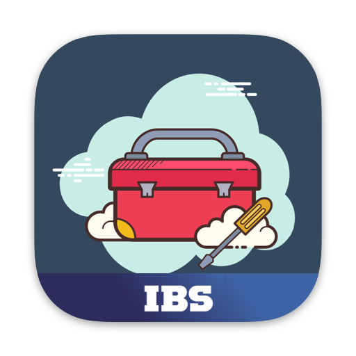

 
 

 
 
 

### Current Release:
**Status:** `Stable`  
**Version:** `1.1.1`  
**Build:** `13`

#### IBSKit is an Xcode Fat Framework written in [Swift 5](https://github.com/apple/swift).

#### `Xcode 14.0+` ﹒ `Swift 5.7+` ﹒ `iOS 13.0+` ﹒ `iPadOS 13.0+`
